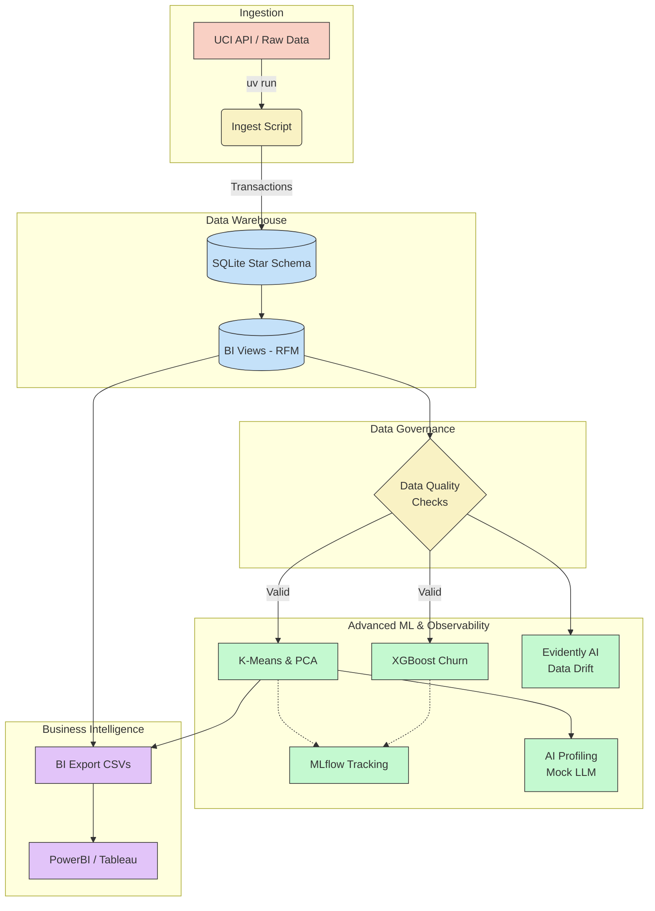
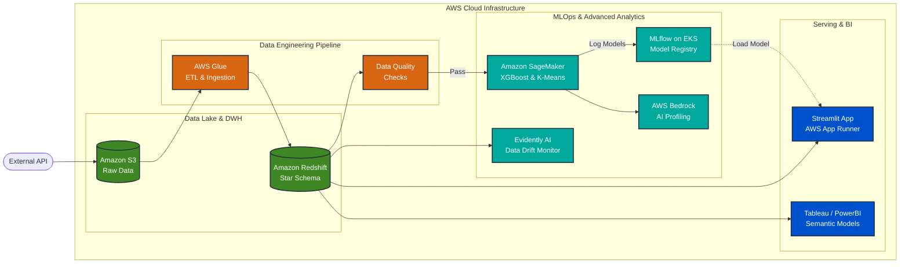
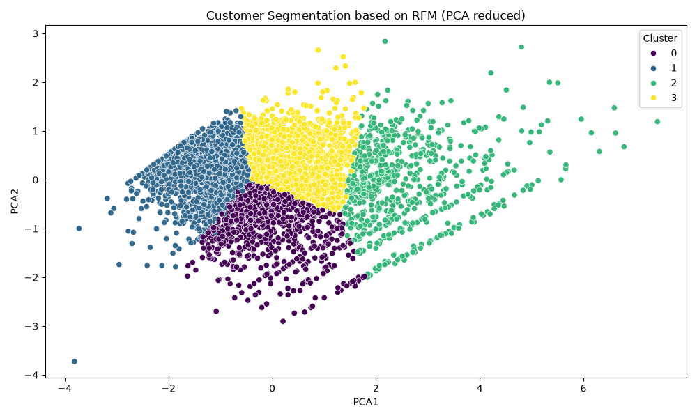
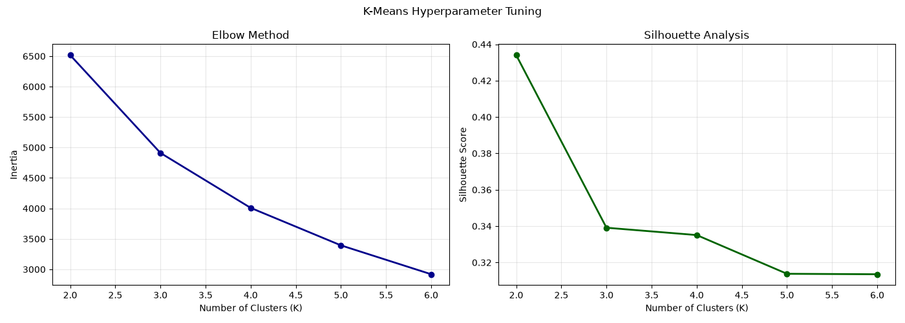
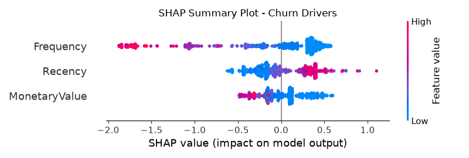
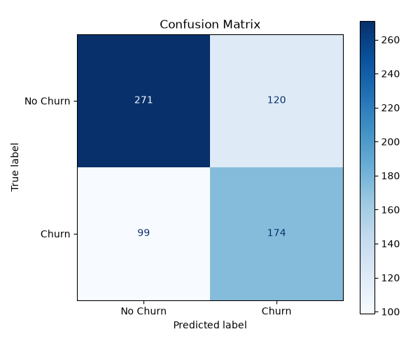
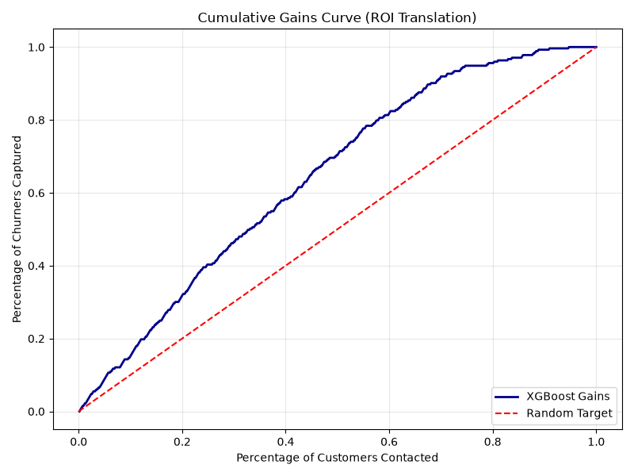

# Enterprise Customer Intelligence Platform: End-to-End MLOps Pipeline & BI Data Warehouse

  

  <strong>A production-ready data platform integrating SQL/SQLite DW, XGBoost Churn Analytics, MLflow Model Registry, Evidently AI Observability, and Streamlit Web Interface.</strong>

  
  
  
  
  
  
  
  
  
  

---

## 🎯 Project Overview

This repository contains a comprehensive **Data Analysis and Business Intelligence (BI)** project using the famous **UCI Online Retail Dataset**. It is designed to demonstrate advanced capabilities in data modeling, statistical/multivariate analysis, and preparation of semantic models for BI tools like Tableau and PowerBI.

### Core Technologies
- **Data Management:** SQL, SQLite (Data Warehouse simulation)
- **Data Analysis & ML:** Python (`pandas`, `scikit-learn`, `xgboost`)
- **Environment & MLOps:** `uv`, `mlflow`, `evidently`
- **Visualization:** `matplotlib`, `seaborn`

## 🏗️ Architecture & Workflow

### ☁️ Enterprise Cloud Deployment (AWS Topology)
While this project runs locally using SQLite and `uv` for ease of evaluation, it is designed with a **Cloud-Native mindset**. Below is the architectural blueprint for deploying this MLOps pipeline to a production AWS environment:

### 1. Ingestion & ETL (Python + SQL)
- The raw data (over 500k transactions) is ingested directly from the UCI Machine Learning Repository via API.
- We utilize SQL DDL (`sql/01_ddl_tables.sql`) to construct a robust **Star Schema** (Fact and Dimension tables) inside SQLite, ensuring referential integrity and optimized querying.

### 2. Data Modeling & BI Views (SQL)
- Complex SQL views (`sql/02_bi_views.sql`) are implemented to prepare Data Marts.
- This includes **Common Table Expressions (CTEs)** and **Window Functions** to build base tables for Cohort Analysis and RFM (Recency, Frequency, Monetary) calculations.

### 3. Data Governance & Quality (MLOps)
- **Data Contracts:** A native Pandas assertion layer validates data integrity before modeling (`src/data/data_quality_checks.py`), ensuring no nulls and valid RFM ranges.

### 4. Multivariate Statistical Analysis (Python)
- **Clustering (K-Means):** The RFM base view is scaled with a log transformation and processed to segment customers.
- **AI Cluster Profiling:** A script (`src/analysis/ai_cluster_profiling.py`) analyzes cluster centroids to generate automated semantic marketing personas.
- **Dimensionality Reduction (PCA):** Applied to reduce the RFM space into 2D for intuitive visualization.

### 5. Advanced ML: Churn Prediction (XGBoost)
- **Supervised Learning:** Features (Recency, Frequency, Monetary) are extracted chronologically. We train an **XGBoost Classifier** (`src/analysis/churn_prediction.py`) to predict the probability of a customer churning.
- **Experiment Tracking:** **MLflow** tracks hyperparameters, logs the final model, and visualizes metrics like ROC-AUC.

### 6. Observability & BI Export
- **Data Drift:** **Evidently AI** evaluates dataset shifts generating an HTML report (`src/analysis/monitoring_evidently.py`).
- **Semantic Models:** The final modeled data is exported into CSVs, formatted for immediate ingestion into BI tools.

## 🖼️ Interactive Model Insights & Artifacts Gallery

To view the advanced data science and MLOps visualizations generated by this platform, expand the slides below:

<strong>📊 Slide 1: Customer Segmentation Clusters (PCA + K-Means)</strong>

 

  

  <em>Figure 1: RFM metrics compressed into 2D via Principal Component Analysis (PCA) and segmented into optimized cohorts using K-Means clustering. This allows for automated semantic customer profiling.</em>

<strong>📈 Slide 2: K-Means Optimization (Elbow Method)</strong>

 

  

  <em>Figure 2: Silhouette analysis and Within-Cluster Sum of Squares (WCSS) to determine the mathematical optimal number of clusters (K) for customer segmentation.</em>

<strong>🔍 Slide 3: Model Explainability (SHAP Feature Importance)</strong>

 

  

  <em>Figure 3: SHAP (SHapley Additive exPlanations) values highlighting the global feature importance and their directional impact on the XGBoost Churn Prediction model.</em>

<strong>📉 Slide 4: XGBoost Churn Model Performance (Confusion Matrix)</strong>

 

  

  <em>Figure 4: Confusion matrix detailing the precision, recall, and classification efficiency of the XGBoost classifier on the test dataset.</em>

<strong>🎯 Slide 5: Business Impact (Cumulative Gains Chart)</strong>

 

  

  <em>Figure 5: Cumulative Gains chart showing how much better the XGBoost model performs compared to a random selection, directly translating model accuracy into targeting efficiency for retention campaigns.</em>

---

## 🚀 How to Run

1. **Install dependencies:**
   Run `uv sync` or `uv install` to set up the virtual environment.
2. **Execute the Pipeline:**
   - Ingest & Model: `uv run src/data/ingest_uci_dataset.py`
   - Data Quality Check: `uv run src/data/data_quality_checks.py`
   - K-Means & PCA: `uv run src/analysis/multivariate_analysis.py`
   - AI Profiling: `uv run src/analysis/ai_cluster_profiling.py`
   - Churn Prediction (XGBoost): `uv run src/analysis/churn_prediction.py`
   - Monitoring & Drift: `uv run src/analysis/monitoring_evidently.py`
3. **MLflow UI:**
   Run `uv run mlflow ui` to view the model tracking dashboard.

## 📊 Analytics & MLOps Highlights
- **End-to-End Architecture:** Combines Data Engineering (SQL), Governance, and Advanced ML.
- **Predictive Analytics:** Implementation of XGBoost to solve tangible business problems (Customer Churn).
- **MLOps Best Practices:** Robust logging with MLflow and model observability with Evidently AI.

## 👤 Author Profile

<table style="border-collapse: collapse; border: none; width: 100%;">
  <tr style="border: none;">
    <td width="150" align="center" style="border: none; vertical-align: middle;">
      
    </td>
    <td style="border: none; vertical-align: middle; padding-left: 20px;">
      <strong>Guillén Concepción</strong> 
      <em>Senior Data Scientist & MLOps Engineer</em>
      

        Experto en diseño, desarrollo y despliegue de soluciones integrales de Inteligencia Artificial. Pragmático y centrado en el valor de negocio, abarcando desde la fase de investigación (CRISP-DM) hasta sistemas de producción escalables, resilientes y auditables utilizando arquitecturas Cloud-Native y prácticas MLOps.
      

      

        
        
        
      

    </td>
  </tr>
</table>

